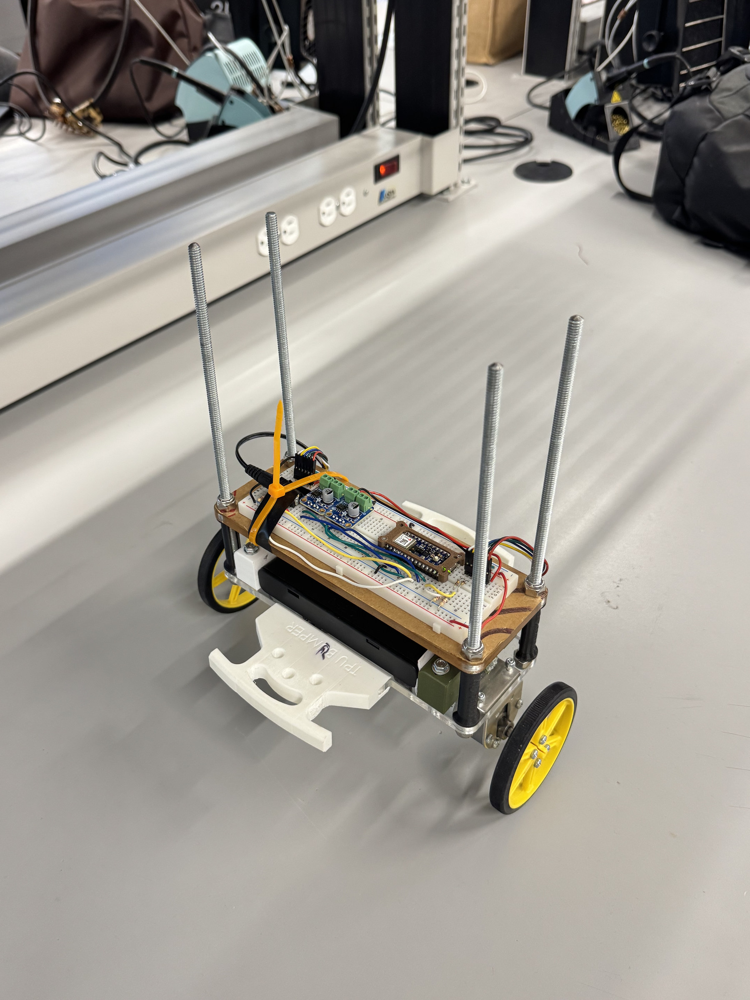
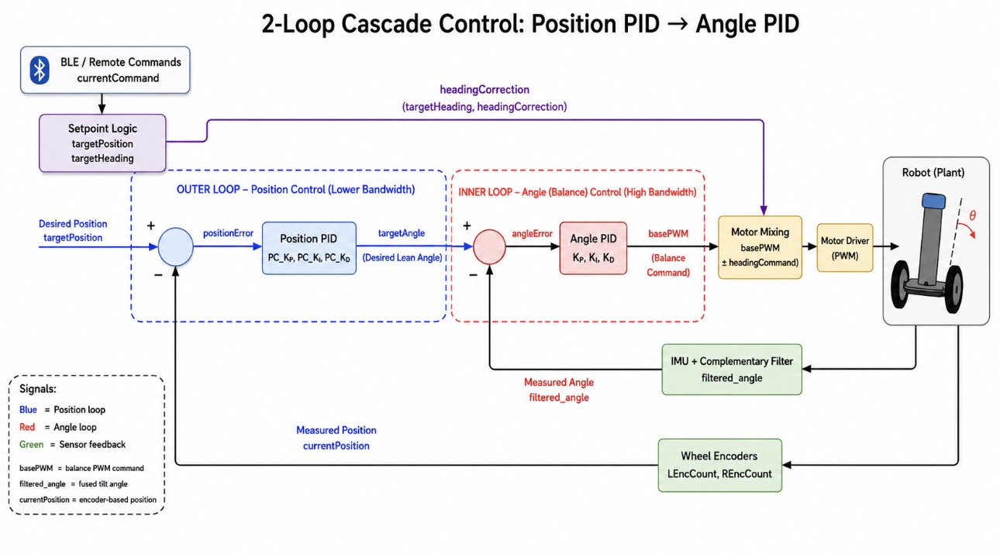
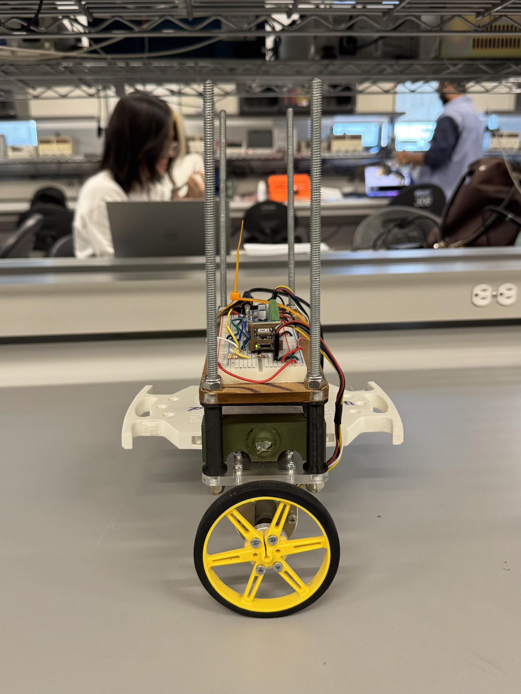
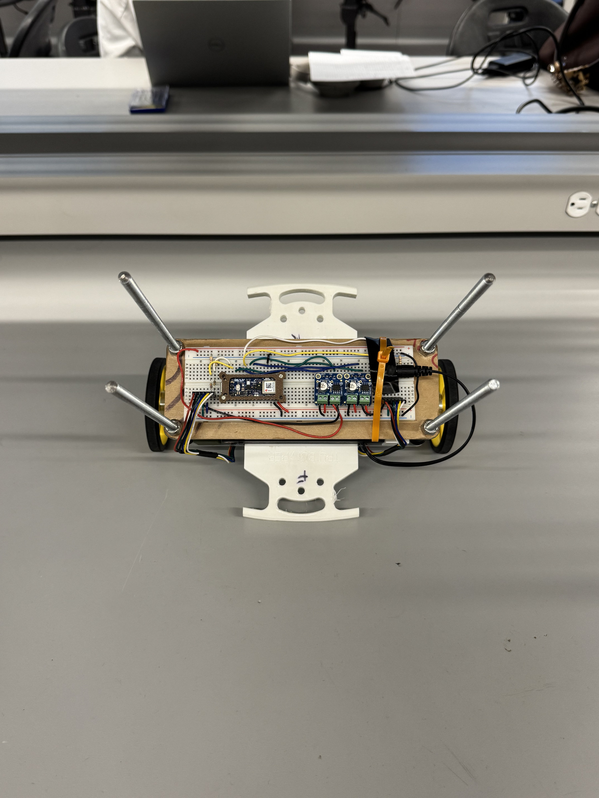

# Self-Balancing Robot

A two-wheeled inverted-pendulum robot built for UBC ELEC 391. An Arduino Nano 33 BLE Sense Rev2 combines onboard IMU measurements with wheel-encoder feedback to balance, move toward position targets, and respond to high-level BLE commands.



The [final integrated firmware](firmware/main/main.ino) is preserved from the implementation used during project development and the final demonstration. This repository does not retroactively change the submitted control implementation.

**Technologies:** Arduino / C++ / embedded systems / PID control / BLE / IMU sensor fusion / encoders

## Demo

▶ **[Watch the Final Project Demonstration](https://drive.google.com/file/d/10kR3wKRSBtR5NIh_Rh7N2LqhAMU-llGo/view?usp=drive_link)**

The demo shows the completed robot performing upright balancing, BLE-controlled forward and backward movement, controlled turning, and ramp testing.

## Documentation

- [Final Project Report](docs/Self-Balancing%20Robot%20Report.pdf) — Full ELEC 391 design, implementation, testing, and analysis report.

## Key features

- Upright balancing with a complementary-filter angle estimate and inner angle PID loop.
- Position-controlled forward and backward movement using the average of two wheel encoders.
- BLE remote commands for movement, stop, staged left/right turns, and ramp mode.
- Heading correction from integrated z-axis gyroscope measurements during straight travel and turns.
- Target-position slew limiting, motor deadband compensation, and a right-motor adjustment during turns.
- Ramp state-machine logic in the main firmware, plus separate sketches for 5°, 10°, and 15° ramp experiments.

## System architecture

The team's control diagram shows the cascaded position and angle loops. Wheel encoders feed the outer position controller, while the BMI270 IMU and complementary filter feed the inner balance controller. Heading correction is mixed with the balance command before motor actuation.



## Control system

The outer loop updates the requested lean angle from encoder position at a 40 ms threshold. The faster inner loop converts the filtered tilt error into a base motor PWM command. Target-position slew limiting smooths movement requests; the motor output also includes heading correction and fixed deadband compensation. See [Control system](docs/control-system.md) for the equations, source values, and ramp behavior.

### BLE control

The Android phone is the **BLE central** and the Nano is the **BLE peripheral**. The phone app was based on a teaching-team template; its source is not included here. The Nano advertises `BLE-DEVICEG1` and receives text commands through a writable characteristic. The firmware recognizes `FORWARD`, `BACK`, `LEFT`, and `RIGHT`; a `B`-prefixed value other than `BACK` selects stop, and an `A`-prefixed value selects ramp mode. A `C`-prefixed command is reserved in the code. Commands select position, heading, or ramp state; motor PWM remains under feedback control.

| BLE item | UUID in the final sketch |
| --- | --- |
| Custom service | `00000000-5EC4-4083-81CD-A10B8D5CF6EC` |
| Read/write/notify characteristic | `00000001-5EC4-4083-81CD-A10B8D5CF6EC` |

## Hardware and mechanical design

| Component | Purpose |
| --- | --- |
| Arduino Nano 33 BLE Sense Rev2 with onboard BMI270 IMU | Runs control and BLE; measures acceleration and angular rate |
| Two DRV8871 motor drivers | Drive the left and right DC motors from PWM and direction signals |
| Two 12 V Pololu DC gearmotors with quadrature encoders | Move the wheels and provide encoder feedback |
| Two-wheel differential-drive chassis | Supports the inverted-pendulum body and turning by differential motor output |
| Onboard battery pack | Powers the mobile robot |

The verified firmware pin map and electrical notes are in [Hardware](docs/hardware.md).

The side view shows the wheel, chassis height, and component mounting. The top view shows the Nano, motor drivers, and wiring layout.

| Side view | Top view |
| --- | --- |
|  |  |

## Results and scope

**Demonstrated in the final project report:** upright balancing, forward/backward movement, controlled turning, and response to BLE remote commands. The report describes ramp traversal **testing** and separate ramp-specific tuning. It does not establish a repeatable completion result for every incline, so the 15° sketch is presented as an experimental variant, not proof of a completed 15° climb. No reliability rate or disturbance-recovery metric is claimed here.

## Engineering challenges

- The motors had different responses across PWM levels. The final sketch uses fixed deadband values and a small right-motor multiplier during turns; its automatic deadband routine is present but disabled.
- Small gyro bias accumulated into heading drift. Startup calibration is used for the x-axis balance signal, while the final sketch uses a measured fixed z-axis offset for heading.
- The team measured loop timing and reduced BLE/sensor-check overhead to improve balance-loop frequency.
- Ramp tuning needed different target distances, lean limits, slew rates, and state transitions. Damaged hardware also required troubleshooting and retuning during development.

## Repository structure

```text
firmware/
  main/main.ino                            Integrated final-demo program
  ramp_variants/ramp_5deg/ramp_5deg.ino   5° ramp-test variant
  ramp_variants/ramp_10deg/ramp_10deg.ino 10° ramp-test variant
  ramp_variants/ramp_15deg/ramp_15deg.ino 15° ramp-test variant
docs/
  Self-Balancing Robot Report.pdf         Full project report
  control-system.md                       Control architecture and verified values
  hardware.md                             Components and firmware pin map
  images/robot-main.jpg                   Main project photo
  images/control-loop-diagram.jpg         Original two-loop control diagram
  images/robot-side.jpg                   Robot side view
  images/robot-top.jpg                    Robot top view
```

The ramp sketches are independent, experimentally tuned programs. They are not replacements for [`main.ino`](firmware/main/main.ino).

## Getting started

1. Install Arduino IDE or a compatible Arduino build workflow and select **Arduino Nano 33 BLE Sense Rev2** with its matching board package.
2. Install the **Arduino_BMI270_BMM150** and **ArduinoBLE** libraries. The source also includes standard `String.h` and `math.h`; no library versions are specified in the supplied material.
3. Open [`firmware/main/main.ino`](firmware/main/main.ino) as the main sketch, or open one ramp variant in its own same-named folder. Verify/compile for the selected board, then upload through the board's connected port.
4. Keep the robot still during startup gyroscope calibration. Review [hardware wiring](docs/hardware.md) before powering motors or connecting encoder signals to the Nano's 3.3 V inputs.

The firmware contains experimentally tuned values for the original hardware. Compilation alone does not validate safe behavior on another build.

## Future improvements

The report identifies closed-loop synchronization of left/right wheel speeds, more robust stationary detection for heading-gyro calibration, a unified or adaptive ramp controller, and automatic calibration of empirically tuned constants as next steps.

## Team and credits

This was a collaborative UBC ELEC 391 team project by **Russel Chan, How Yee Chaw, Matthew Wu, and Mohammad Ghazi**. The Android BLE app was based on a teaching-team template; only the robot firmware is included here.
